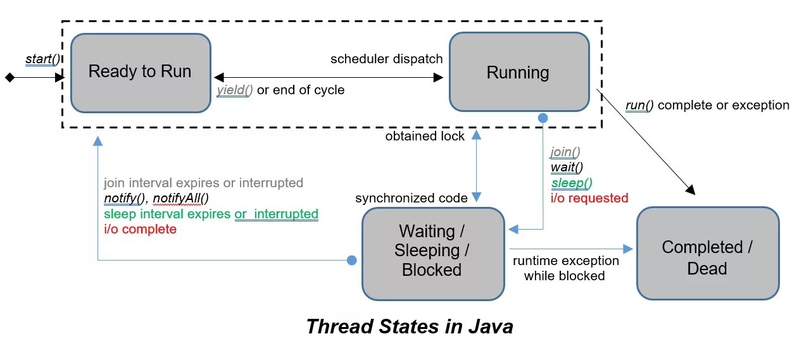

# Многопоточность

8.0. Состояния

___

Задача
--------

>Выведите состояние потока перед его запуском, после запуска и во время выполнения.
>
>Каждый поток пребывает в одном из следующих состояний (state):
>- Создан (New) – очередь к кадровику готовится, люди организуются.
>- Запущен (Runnable) – наша очередь выстроилась к кадровику и обрабатывается.
>- Заблокирован (Blocked) – последний в очереди юноша пытается выкрикнуть имя, но услышав, что девушка в соседней группе начала делать это раньше него, замолчал.
>- Завершён (Terminated) — вся очередь оформилась у кадровика и в ней нет необходимости.
>- Ожидает(Waiting) – одна очередь ждёт сигнала от другой.

___
Решение:
--------

~~~Java
    Thread thread = new Thread() {
        @Override
        public void run() {
            System.out.println(getState());
        }
    };

    System.out.println(thread.getState());
    thread.start();
    try {
        // Тут маленькая сложность есть только для вывода состояния TERMINATED:
        thread.join();
    } catch (InterruptedException e) {
        e.printStackTrace();
    }
    System.out.println(thread.getState());
~~~

Добавим WAITING и BLOCKED:

~~~Java
    /**
     * Вывод состояния WAITING
     * 
     * @param strings
     * @throws InterruptedException
     */
    public static void main(String[] strings) throws InterruptedException {
        Object lock = new Object();

        Thread thread = new Thread() {
            @Override
            public void run() {
                try {
                    synchronized (lock) {
                        lock.notifyAll();
                        lock.wait();
                    }
                } catch (InterruptedException e) {
                    e.printStackTrace();
                }
            }
        };

        synchronized (lock){
            thread.start(); // Запустим поток
            lock.wait(); // Будем ждать, пока поток не запустится
            System.out.println(thread.getState()); // WAITING
            lock.notifyAll();
            System.out.println(thread.getState()); // BLOCKED
        }
    }
~~~

Для TIMED_WAITING немного изменим тот же код:

~~~Java
    /**
     * Вывод состояния WAITING
     *
     * @param strings
     * @throws InterruptedException
     */
    public static void main(String[] strings) throws InterruptedException {
        Object lock = new Object();

        Thread thread = new Thread() {
            @Override
            public void run() {
                try {
                    synchronized (lock) {
                        lock.notifyAll();
                        lock.wait(3000);
                    }
                } catch (InterruptedException e) {
                    e.printStackTrace();
                }
            }
        };

        synchronized (lock) {
            thread.start(); // Запустим поток
            lock.wait(); // Будем ждать, пока поток не запустится
            System.out.println(thread.getState()); // WAITING
        }
    }
~~~
Итог: 
--------

>- [X] Есть готовое решение 
>- [ ] Свой код написан 
